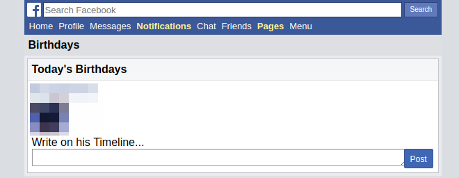
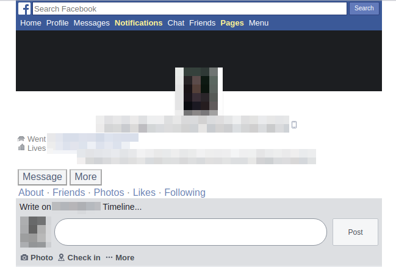
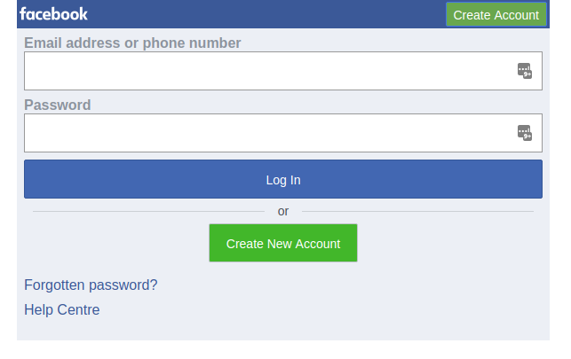

  

_I know. I know. It’s been a long while since I’ve actually published a post. I’ve been busy and I’m very picky about the quality of articles I put out but I know that’s no excuse so here’s one to make up for it._

**_Obligatory Disclaimer:_**_  
Do note that the content in this article may or may not be against Facebook’s terms and conditions, so do tread with caution. Some of the code in this article could be used for nefarious/malicious purposes so I accept no liability or responsibility in any case. I also take no liability or responsibility if this code malfunctions, breaks your computer, blows up your house, becomes sentient or steals your girlfriend/wife._

Come closer. I have a secret you might want to hear.

If you ever got a birthday wish on your cake day from me on Facebook, there’s a chance that it wasn’t actually me who sent it. Let me clarify to you that this isn’t always the case since I almost always personally message and wish the people closest to me (when I’m able to).

If anyone knows me well enough, they would know that my memory is terrible. Absolutely terrible. I’m especially terrible with dates, which is not really a good thing in the long run when you forget your wedding anniversary or your wife’s birthday and have to spend the night in the doghouse, but let’s not plan that far ahead just yet. I don’t necessarily believe in birthdays though. I think of them as a reminder of how old I really am getting and how I’m haven’t really amounted to anything much in life but unlike me, the majority of my friends tend to put more significance to their cake days and as their “beloved” friends, we feel inclined to wish them on their birthday, since Facebook doesn’t easily allow us to miss them. Spending time every day wishing people can feel a bit arduous though and I am a believer in the “[Three Strikes and you Automate](http://wiki.c2.com/?ThreeStrikesAndYouAutomate)” rule, so it was about time I automated it.

What’s my motive for making this? I’ll be honest. The only reason I did it was because I wanted to see if I _could_ do it.

Okay now. Less talk, more code.

)](./asset-1.jpeg)

_Off-topic side note: It took a long time for me to actually find the source of this comic. Every version I find of this crops the author’s name off. Always credit the author(s), yo._

Anyone who has ever attempted to scrape Facebook would notice that the majority of Facebook’s sites ([web.facebook.com](http://web.facebook.com) and [mobile.facebook.com](http://mobile.facebook.com)) are Javascript heavy. Since I don’t intend on emulating a browser (which can be done via `[jsdom](https://github.com/jsdom/jsdom)` or `[puppetee](https://github.com/GoogleChrome/puppeteer)r`) or messing with their finicky, undocumented private APIs (and I also don’t want to spend too much time on an experiment), we’re going to be using a lesser know known, javascript-less version of Facebook ([mbasic.facebook.com](http://mbasic.facebook.com)) which will work seamlessly with`[cheeri](https://github.com/cheeriojs/cheerio)o` since it’s all plain HTML and forms (and butterflies and rainbows, hooray!). Perfect.

Let’s pause for a bit and think of what the actual process would be like.

1.  First, we’d need to figure out where in Facebook would we able to extract either the birthdays of your friends. We’ll be able to scrape that from [https://mbasic.facebook.com/events/birthdays/](https://mbasic.facebook.com/events/birthdays/).

2.

3\. Login

  

Now to break out the process into individual functions.
