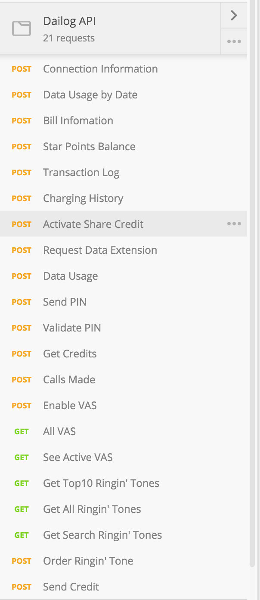

#### Responsible Disclosure

This happened around March — April and by now, a lot of it has already been patched up and rectified (hopefully). I don’t really know of the legal implications of me releasing this information, but please spare me?

**EDIT: READ THIS. This article was not meant to ruin Dialog Axiata’s reputation or show them in a bad light. Rather, it was written to cast a light on the importance of security and good practices. Let me be clear. Dialog Axiata was not “hacked” in the sense that their systems were compromised. Rather, it was more of a bug in a product of theirs that was outsourced to an external company. This is not the first time this has happened to a company and has happened countless times to other big name companies all over the world i.e Facebook, Dominos, Tinder, Uber, etc. (**[**Here’s a similar article about Domino**](http://www.ifc0nfig.com/dominos-pizza-and-payments/)**s)**

A couple of months ago, I picked up a nice little 4G router from Dialog along with the 25GB data package. I was proud that, after 16 years, I finally had a (relatively) stable internet connection to work with. A few weeks — and a couple of nights more of binge watching everything I missed out on — I noticed that my internet speed had dropped from a mighty 35 mbps (at best) to a measly 15 kbps. I figured I had eaten through my data-plan (and definitely regretted my binge sessions) so I needed a way to keep track of my data usage and warn me well in advance before I hit the limit. Unfortunately, there was nothing of that sort available that was intuitive enough, so I went out to build one for myself.

I looked for avenues to which I could programmatically retrieve data. The website looked interesting enough, but seemed too complicated and I really didn’t want to hassle myself with it ( plus it’s a pain in the neck to have to scrape webpages for that sort of content ).

What if I could track it via the router itself? The router had an API to which the [Huawei HiLink](https://play.google.com/store/apps/details?id=com.huawei.mw&hl=en) would use to connect to. I immediately started a module to start interfacing with it, but there were discrepancies between the router’s bandwidth values and the actual bandwidth usage on the website, so I stopped working on it..

[**ishan-marikar/dialog-router-api**  
_dialog-router-api - A wrapper to connect with and query the API on the Huawei 4G routers provided by Dialog Telecom_github.com](https://github.com/ishan-marikar/dialog-router-api "https://github.com/ishan-marikar/dialog-router-api")

A friend of mine suggested that I try the Dialog Self-Care app in the Play Store which made me curious to see if I could use whatever endpoint it was using to be able to get the data I needed. I figured that it could have some sort of authentication and I would have to emulate it to be able to access my bandwidth stats.

So I fired up mitmproxy and routed the traffic from my phone through my laptop and started seeing the requests that were being made. What turned out was not really what I expected.

Most of the requests contained an ‘imsi’ parameter (IMSI being a unique id assigned by the network for your device) and an ‘nic’ parameter (your NIC or passport number) which weren’t really being validated, so sending empty or null values somehow seemed to work.

Suprised? So was I when I found out.

I looked into the URIs a bit further and tried opening them directly via Chrome. Looks like they hadn’t turned off development mode, so whenever an error occurred (usually when the expected parameters weren’t sent), it would spit out whatever portion of the code that triggered the error along with a stack trace. This allowed me to figure out the parameters and values easily.

My curiosity got the best of me and I tried it again, this time replacing my number with someone else’s. (I didn’t really take a screenshot of it since it revealed too much personal information i.e full name, address, NIC number and what-not, so here’s one of the router’s connection number where it didn’t really respond with much)

I wanted to know what more I could do with this. What would a person of malicious intent have used it for? I burrowed deeper into this rabbit hole and a couple of hours later, I had compiled a list of almost everything (interesting or useful) I could make it return or do. Of course there was a lot more, but I was deprived of sleep and my brain wasn’t functioning well enough.

I discovered that you could activate and use the share credit feature of a number. I tried it on a close friend of mine (a wise man once said that it is was easier to ask for forgiveness than to ask for permission), enabled the share credit feature on his connection and used the default ‘1234’ pin-code to authenticate the transfer.

.. and, it worked! It was tainted with my phone number of course, so it didn’t really require much detective work to figure out who did it.

I wanted to contact Dialog about this, but there wasn’t really anywhere on their site where I could report security issues or bugs.

Somehow oneway or another, I got their attention and I had this reported this to them. IMHO, Dialog really needs to make it easier to for us to inform them of stuff like this in the future.

(I also got in touch with Shafraz Rahim, and briefed him on it)

I had swayed so far away from what I had initially set out to build. A little utility for myself so I could keep track of my data usage, but it had escalated into something else entirely.

I wanted to keep things modular, so I wrote a little library.

[**dialog-data-usage**  
_A module to measure and monitor your Dialog 4G/LTE data usage_www.npmjs.com](https://www.npmjs.com/package/dialog-data-usage "https://www.npmjs.com/package/dialog-data-usage")

At this point, most of the what was possible with what I had discovered was patched, except the bandwidth stats. Bless their souls.

I started building my little application, which I named ‘iwarada?’ (meaning ‘finished?’ in Sinhala). It was powered using Electron and looked pretty crude, but it worked.

A friend of mine by the name of Treasure Priyamal made took the concept (or at least part of it) and turned it into an angular.js web-app. I was impressed, so I worked with him on it and ended up with..

.. this masterpiece. Okay, maybe it wasn’t all that pretty, but, hey. It gets the job done. You didn’t have to jump through hoops to be able to see your data balance.

I shared it on a couple of groups and a lot people seemed to like it. Others were curious as to how we were able to get something of that sort working.

People started sharing it (and this made me smile, because, well.. why would you not smile when somebody find value in something you build?)

.. but the site had to go down because the engineers at Dialog had noticed a lot of requests coming in without IMSIs or NICs on that endpoint (just for the bandwidth stats one, everything else was already patched by then) and decided to patch that up to.

My inbox got flooded with people telling me it wasn’t working anymore, so I setup an apology page and redirected all user traffic to that. It also didn’t feel right either, and I hadn’t asked for permission, so it was about time I had taken it down.

Well, It was fun while it lasted, and I hope I hadn’t caused too much trouble to the poor chaps at Dialog Axiata.
