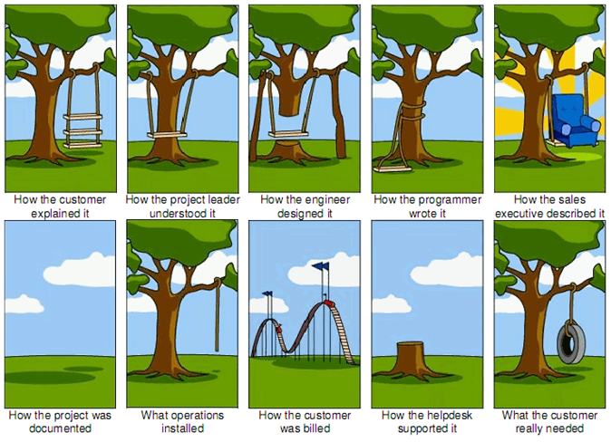

.. or how not to over-engineer.

According to wikipedia, over-engineering is ..

> .. the designing of a product to be more robust or complicated than is necessary for its application, either (charitably) to ensure sufficient [factor of safety](https://en.wikipedia.org/wiki/Factor_of_safety "Factor of safety"), sufficient functionality, or because of design errors. It can also be desirable when safety or performance on a particular criterion is critical, or when extremely broad functionality is required, but it is generally criticised from the point of view of [value engineering](https://en.wikipedia.org/wiki/Value_engineering "Value engineering") as wasteful.

.. or as Ruban/Dulitha would so eloquently put it:  
_“solving problems we don’t have yet”_.

We, as engineers, have a tendency to build more than what is necessary based on speculation. All these what-ifs and all the edge-cases, all the things that could potentially happen and being overly obsessed with the product being fool-proof.

> "Don't try to assume/imagine. Do what you know now." —  [Gianluca Romanin](https://disqus.com/by/gianlucaromanin/) 

